# Lonely At The Top
This is the official repository of team LONELY AT THE TOP for the World Robot Olympiad Future Engineers category. This repository contains everything related to the development of the robot. And this README contains the official documentation of the team.

# 📜 Repository Overview

Welcome to our robotics project repository! Here's a breakdown of the contents:

- **`schemes/`**  
  Contains the circuit diagrams used in our robot.

- **`models/`**  
  Includes all the 3D printed parts of the robot that will be taken to the international competition.

- **`src/`**  
  All source code for both challenges — with and without obstacles.

- **`t-photos/`**  
  Photos of the team, including one formal shot and one funny shot.

- **`v-photos/`**  
  Photos of the robot from every angle, including previous versions.

- **`video/`**  
  Contains videos where you can see our robot in action, completing both challenges.

- **`README.md`**  
  Our complete development journey! Here we explain every aspect of building the robot — from design to implementation.

# Components
A list of all the electrical components in the robot.
<table>
  <tr>
    <td><strong>Step Down Module</strong></td>
    <td><strong>Raspberry Pi 5</strong></td>
    <td><strong>Raspberry Pi 12MP Camera Module 3</strong></td>
  </tr>
  <tr>
    <td>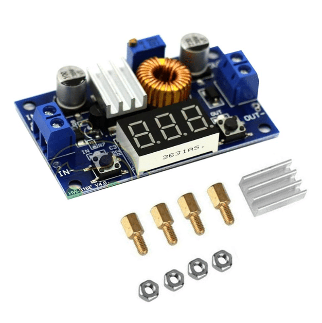</td>
    <td>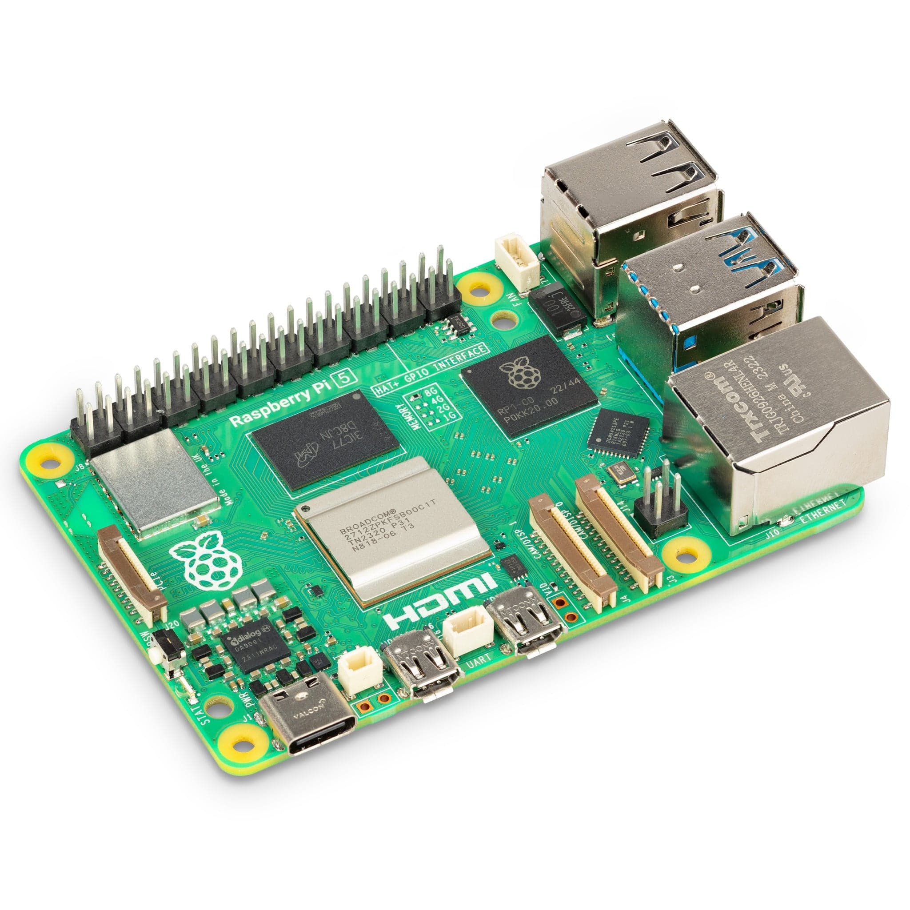</td>
    <td>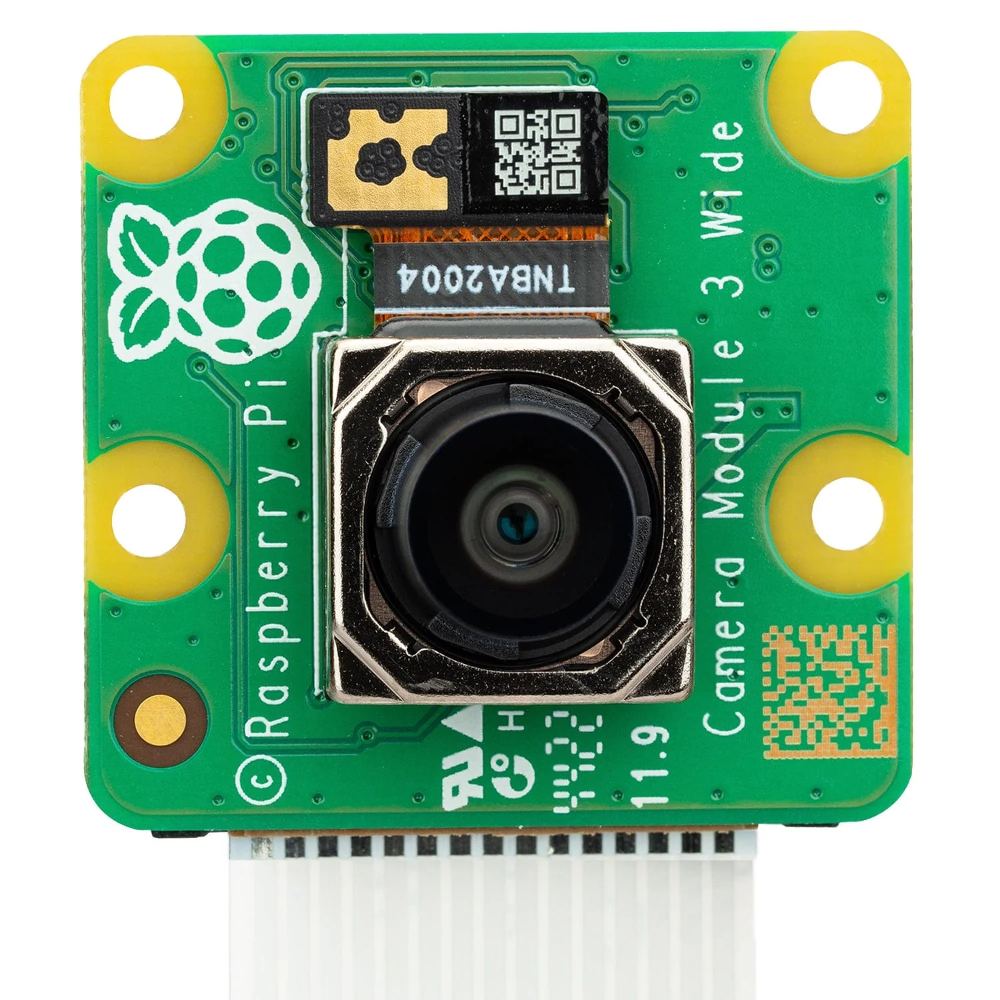</td>
  </tr>
  <tr>
    <td><strong>Arduino Nano</strong></td>
    <td><strong>10k ohm resistor</strong></td>
    <td><strong>Push Button</strong></td>
  </tr>
  <tr>
    <td>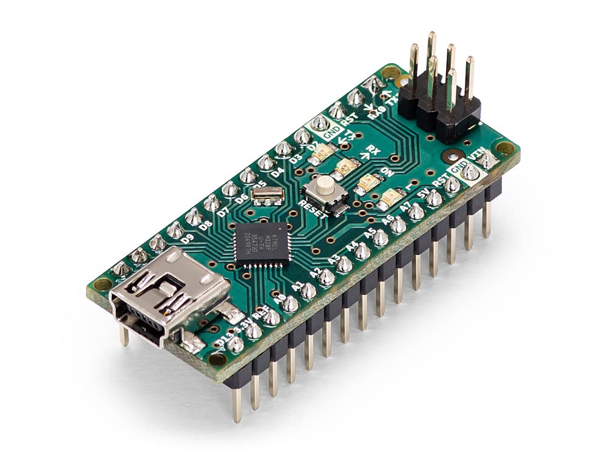</td>
    <td>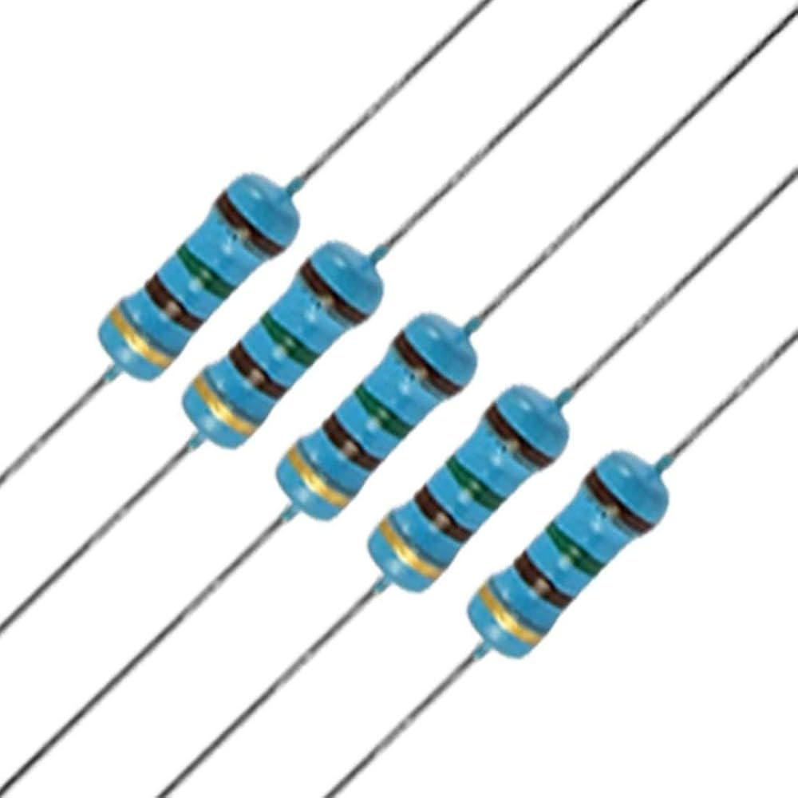</td>
    <td>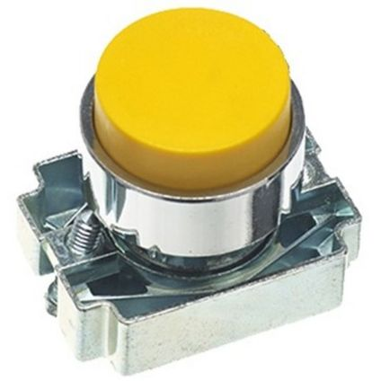</td>
  </tr>
  <tr>
    <td><strong>USB cable A to USB Mini B</strong></td>
    <td><strong>4x 18650 Batteries</strong></td>
    <td><strong>Jumper Wires</strong></td>
  </tr>
  <tr>
    <td>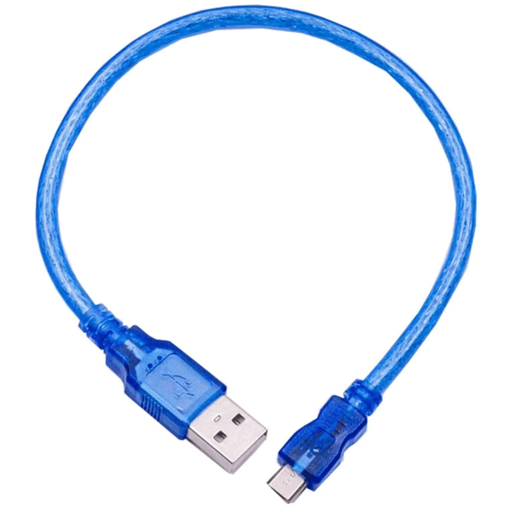</td>
    <td></td>
    <td>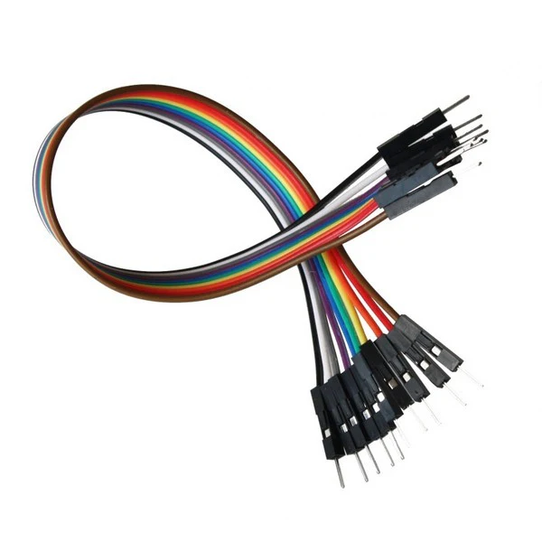</td>
  </tr>
  <tr>
    <td><strong>Raspberry Pi FPC Camera Cable</strong></td>
    <td><strong>LaTrax Rally 75054</strong></td>
    <td></td>
  </tr>
  <tr>
    <td>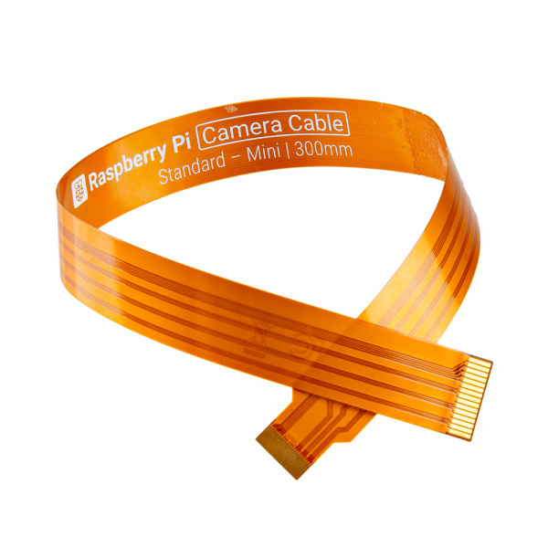</td>
    <td>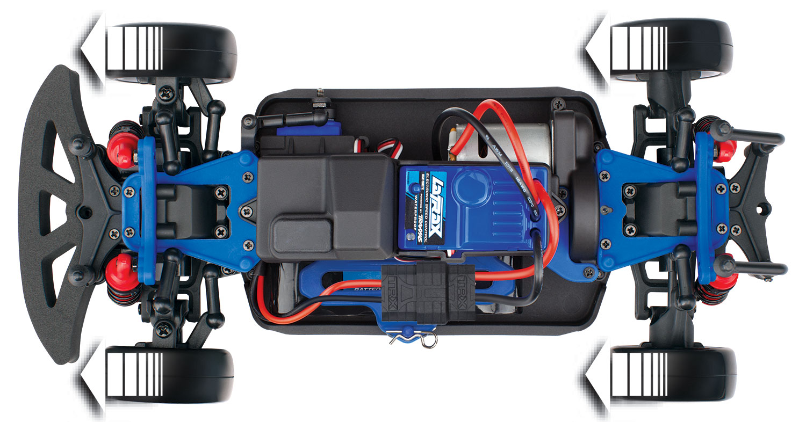</td>
    <td></td>
  </tr>
</table>

Below we show how we connect all these componenents
## 🧩 Use of Each Component

### 🔌 DC-DC XL4015 Adjustable Step-down Module (5A 75W with Digital Voltmeter)
This power module is used to **step down the voltage** from our 2s2p 18650 battery pack (8.4V when fully charged) to a stable **5.2V**, which is ideal for powering the **Raspberry Pi 5**.  
The built-in digital display helps us monitor the output voltage easily and adjust it precisely, ensuring the Raspberry Pi receives clean and safe power throughout operation.

---

### 🧠 Raspberry Pi 5
This serves as the **main processing unit or brain** of our robot. It handles:
- Real-time image processing from the camera module  
- Sensor data interpretation  
- Pathfinding algorithms and decision-making logic  
- Communication with the Arduino Nano  

We chose the Raspberry Pi 5 due to its powerful processor, increased RAM, and GPIO compatibility, making it perfect for compute-heavy robotics tasks.

---

### 📷 Raspberry Pi 12MP Camera Module 3
This camera captures **high-resolution images** of the game field, which are then processed by the Raspberry Pi for tasks such as:
- Line and object detection  
- Path planning  
- Visual-based decisions  

Its high quality and native Pi compatibility make it ideal for real-time computer vision applications.

---

### 🧰 Arduino Nano
The **Arduino Nano** is used as a dedicated microcontroller to:
- Interface with motor drivers  
- Control the steering servo and drive motors  
- Execute low-level, timing-critical control tasks  

This division of labor makes the control system more efficient and responsive.

---

### 📏 10kΩ Resistor
We use this as a **pull-down resistor** in our push button circuit to ensure that the GPIO pin connected to the button reads a stable LOW state when the button is not pressed, preventing **false signals**.

---

### 🔘 Push Button
A simple button used to **start or stop the robot's program**.  
It gives us manual control over the code execution without needing remote access or a keyboard.

---

### 🔋 18650 Lithium-ion Batteries (2s2p Configuration)
We wired four 18650 cells in a **2-series 2-parallel** configuration to:
- Get a nominal voltage of 7.4V (8.4V when fully charged)  
- Double the capacity and current output  

This ensures sufficient runtime and power delivery for the Raspberry Pi and motors.

---

### 🧵 Jumper Wires
Used to connect various components such as:
- Sensors to the Raspberry Pi  
- GPIO pins to the button and ultrasonic module  

They offer flexibility and are great for testing and prototyping.

---

### 🔌 USB Cable A to Mini B
This cable connects the **Raspberry Pi to the Arduino Nano**, enabling:
- Power supply to the Arduino  
- Serial communication for sending control commands  

Essential for integrating the two microcontrollers.

---

### 🚗 LaTrax Rally 75054 Chassis
This is a **commercial RC car chassis** we used as the robot's base. It provides:
- A strong and stable platform  
- Built-in drivetrain and suspension  
- Easy mounting for electronics and sensors  

It reduced the time spent on mechanical design and improved mobility and reliability.

---

### 🎥 Raspberry Pi FPC Camera Cable (Standard-Mini)
This flexible flat ribbon cable connects the **Camera Module 3** to the Raspberry Pi.  
The mini connector fits perfectly with our camera, and the cable length allows us to position the camera optimally for capturing the game field.

---

# Circuit Diagram
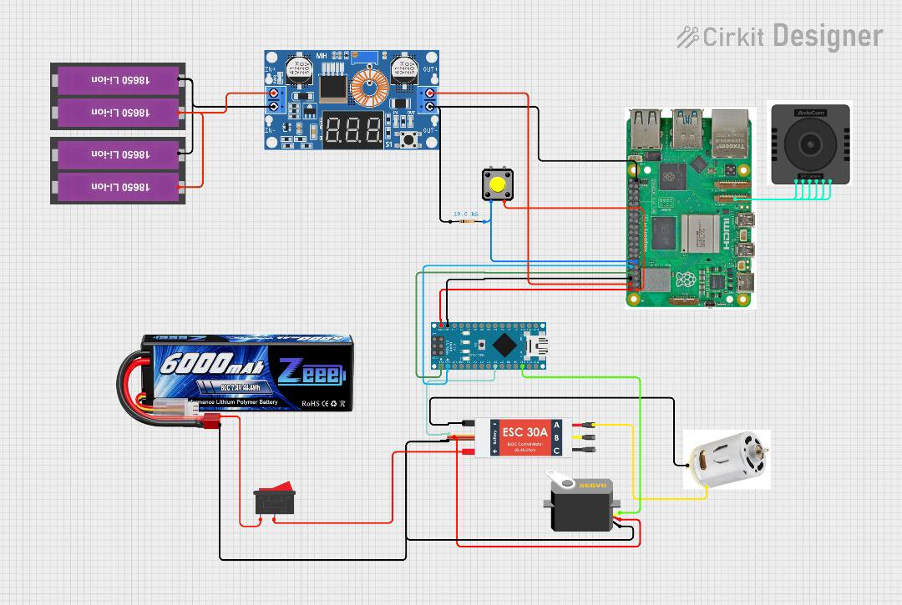

This circuit diagram represents the core electronic system of our robot, powered by two distinct battery packs and controlled using both an **Arduino Nano** and a **Raspberry Pi 5**. Each component is strategically connected to fulfill its specific function in the robot's operation.

### ⚙️ Power Supply and Regulation

- The system uses two battery packs:
  - A **2S2P 18650 Li-ion battery pack** to power the Raspberry Pi through a **DC-DC XL4015 step-down converter**, which regulates the voltage from 8.4V down to 5.2V to ensure safe operation of the Pi.
  - A **6000mAh 7.4V LiPo battery** is dedicated to powering the **DC motor** via an **ESC (Electronic Speed Controller)**, providing the high current required for reliable movement and acceleration.

### 🧠 Microcontroller & Microprocessor

- The **Raspberry Pi 5** serves as the central processing unit of the robot. It:
  - Processes data from the **Raspberry Pi Camera Module**
  - Sends movement instructions to the **Arduino Nano**
  - Interfaces with input components like the **push button** through GPIO pins

- The **Arduino Nano** is responsible for:
  - Receiving control commands from the Raspberry Pi
  - Driving the **servo motor** for steering
  - Sending PWM signals to the **ESC** to control the DC motor
  - Handling low-level real-time tasks for precise control

### 📷 Camera Integration

A **12MP Camera Module 3** is connected to the Raspberry Pi using a **FPC ribbon cable**. This camera captures visual data from the field for image processing tasks such as:
- Line tracking
- Object detection
- Lane following and obstacle avoidance

This enables the robot to make autonomous navigation decisions based on what it "sees."

### 🔁 Actuation

- A **DC motor**, connected through an **ESC**, provides torque and speed for forward and backward movement.
- A **servo motor** controls the steering mechanism of the chassis, allowing the robot to make turns with precision.

### 🎮 Input and Control

- A **push button** is connected to the Raspberry Pi via GPIO pins and a **10kΩ resistor** (as a pull-down resistor) to prevent floating values. This button is used to **start or stop** the program execution manually.
- **Jumper wires (UTP)** are used to make precise connections between components like the sensors, Arduino, and Raspberry Pi, ensuring signal integrity and clean communication.

---

### ✅ Summary

This modular design ensures:
- **Separation of logic and power domains**, preventing electrical noise or surges from affecting control logic
- **Efficient power delivery** to both the Raspberry Pi and motors
- **Clear division of responsibilities** between the Raspberry Pi (for high-level processing) and Arduino (for motor control)
- **Scalability**, allowing us to easily modify or extend the system for future challenges

The diagram illustrates a robust and well-integrated control system suitable for real-world robotic competitions, ensuring stability, performance, and flexibility in operation.


# 3D Parts
| Part       | Description              |
|------------|--------------------------|
| 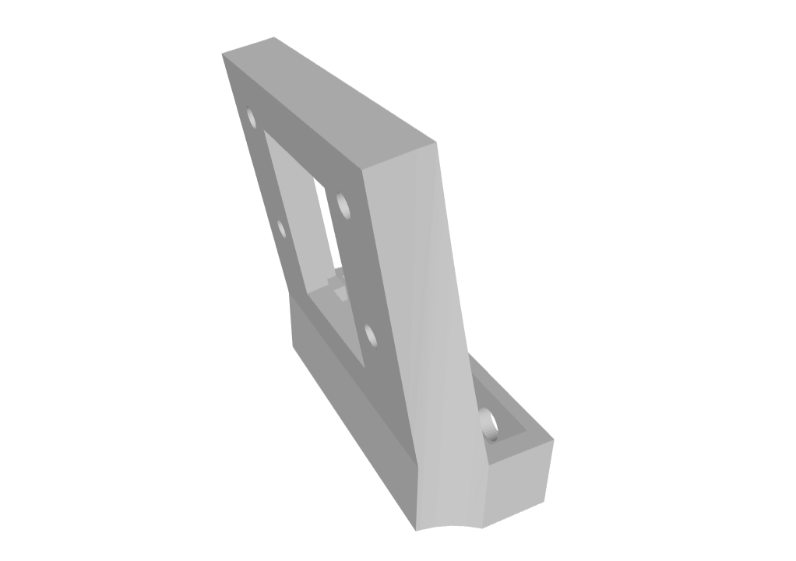 | This 3D-printed component serves as a protective and structural housing for the camera, referred to as the camera mold. It is angled at approximately 170 degrees to optimize the camera's field of view, enabling better visibility of the game field during operation. |
| 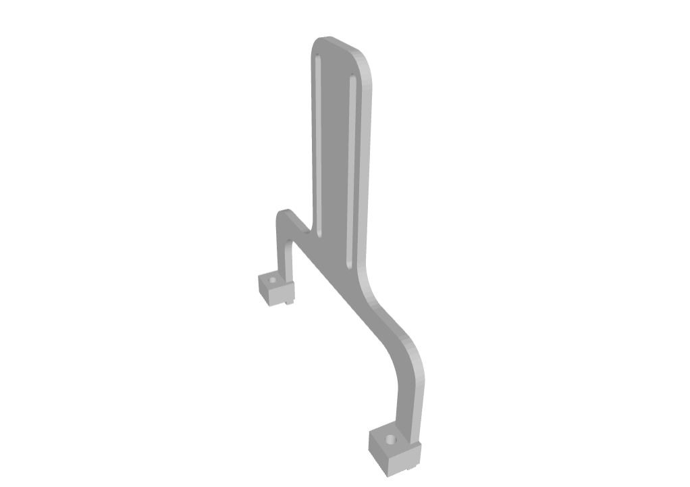 | This is the camera support frame, designed to pair with the camera mold to ensure stable and accurate camera positioning. Its adjustable height mechanism allows fine-tuning of the camera's elevation to achieve the desired field of view, enhancing visibility of the game field. |
| 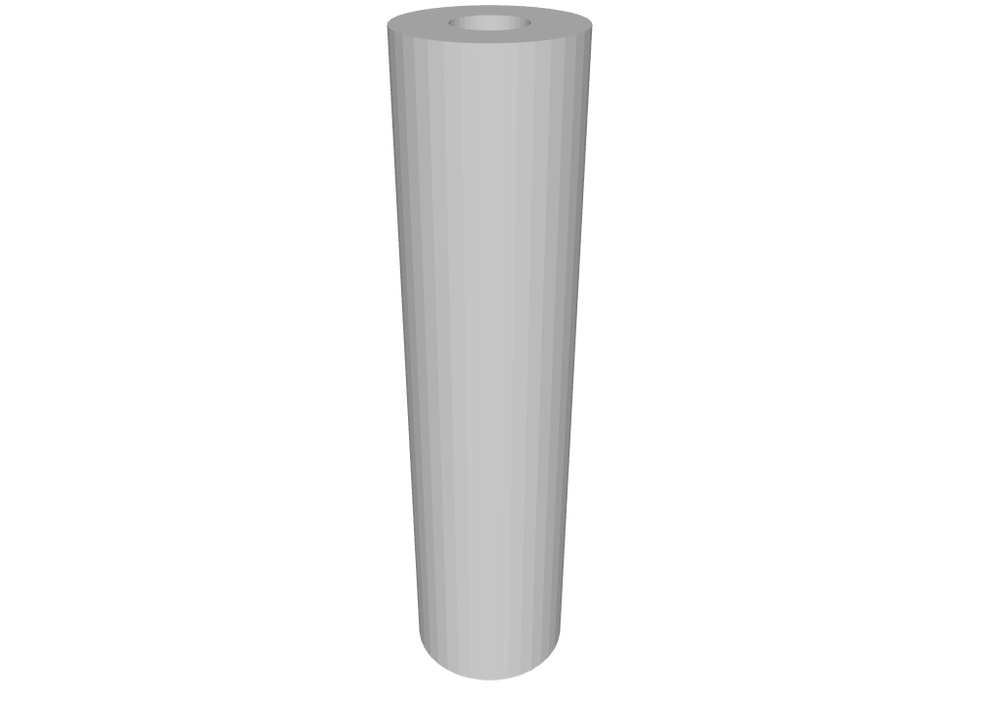 | These pillars serve as the structural supports for the robot, holding up each deck and ensuring overall stability. Designed to bear the weight of the stacked components, the eight pillars also provide connection points that keep the entire robot assembly securely integrated |
| 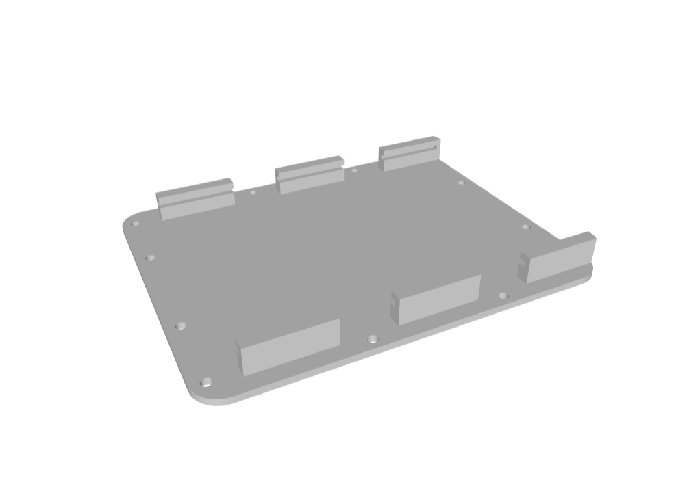 | This is the second deck (counting from the top), designed to hold the step-down power module and the batteries that supply power to the Raspberry Pi 5. It provides a stable platform for power distribution components and ensures efficient use of vertical space in the robot’s design. |
| 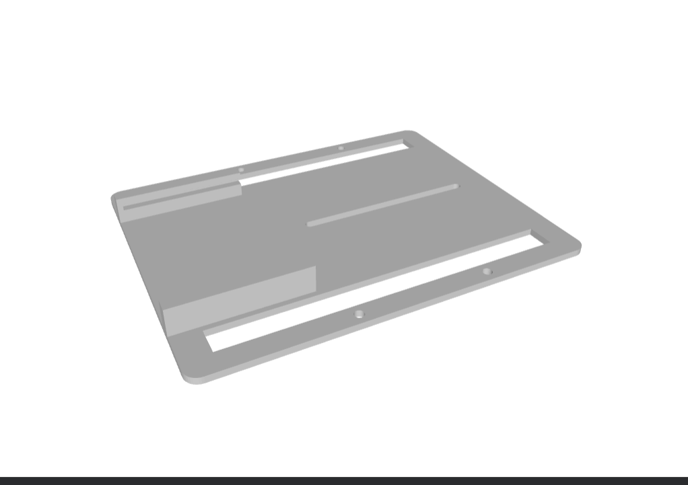 | This is the first deck (topmost level), which houses the Raspberry Pi 5, Arduino Nano, and a control button. It also interfaces with the camera support frame, featuring a sliding mechanism that allows the frame to be adjusted forward or backward as needed to optimize the camera’s positioning. |
| 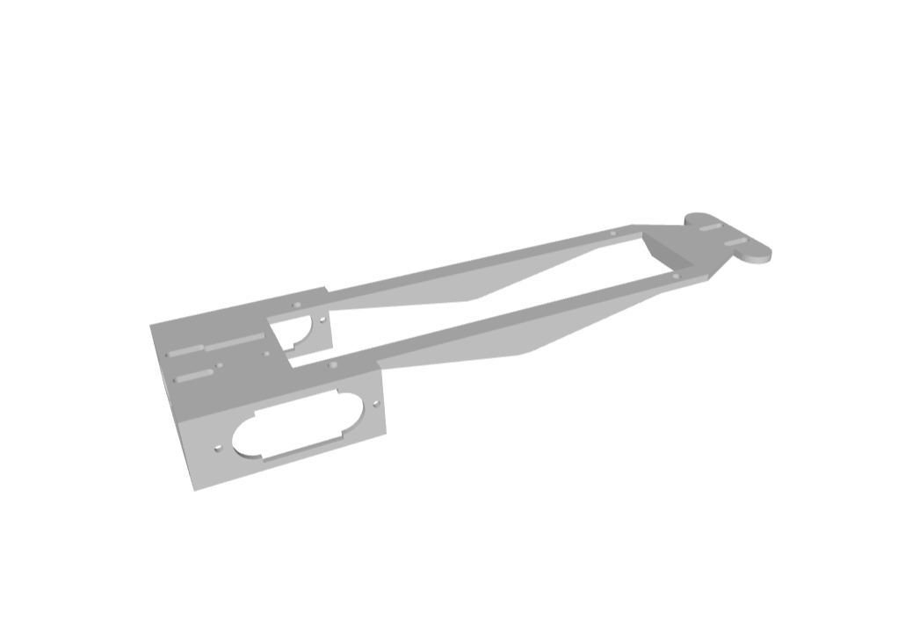 | Serve as the foundation for the robot's structure. Provides support for all other printed components and form the critical connection between the RC chassis and the custom 3D-printed assemblies, ensuring a stable and integrated build.  |
| 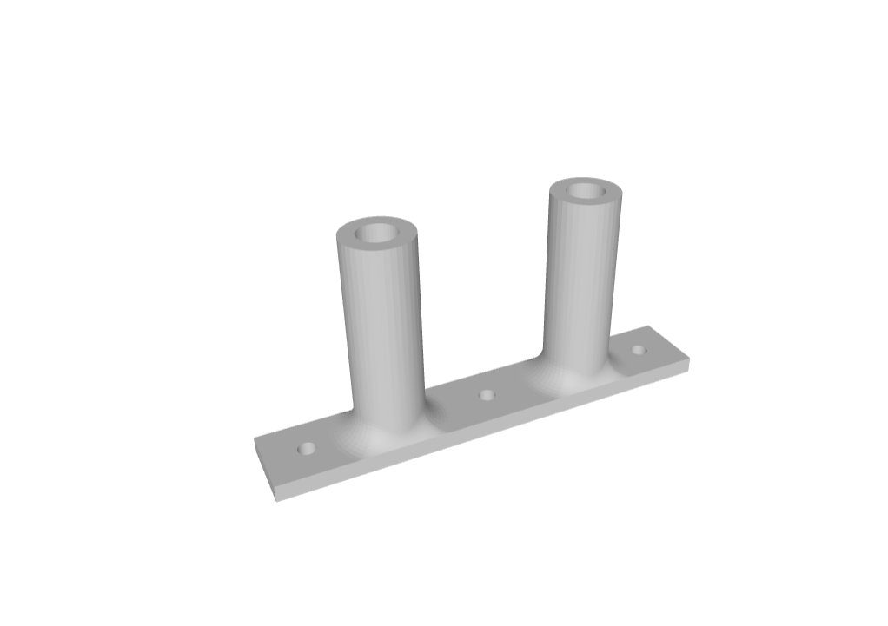 | Combined with the support frame above to perform it's function. There's two of this part |

# Code and Programming Overview

The codebase is divided into two main components, each located in separate folders:

## PiArduinoInterface

This folder contains the Arduino code responsible for low-level control of the vehicle. It manages the **steering servo** and **driving motor**, and receives commands from the Raspberry Pi over a serial interface.

### File Overview

#### `PiArduinoInterface.ino`
The main entry point of the Arduino program:
- Sets up serial communication and initializes hardware components (servos and motors).
- Continuously reads and parses commands sent from the Raspberry Pi.
- Executes commands such as setting motor speed or adjusting servo angles.
- Includes an **auto-stop safety feature** that stops the motor if no command is received within a set interval.

#### `commands.h`
Defines the set of valid single-character serial commands used by the Raspberry Pi to control the Arduino:
- Examples include:  
  - `'s'` – Set servo position  
  - `'m'` – Set motor speed  
  - `'d'` – Digital read  
  - `'a'` – Analog read  

These commands are parsed and executed in `PiArduinoInterface.ino`.

#### `servos.h`
Declares the `SweepServo` class and configuration settings for the servos:
- Controls how fast the servo sweeps to its target position.
- Stores pin assignments and initial angles.
- Declares a global array `servos[]` for managing multiple servos.

#### `servos.ino`
Implements the `SweepServo` class:
- Smoothly moves a servo to a target position one degree at a time.
- Supports adjustable speed via a delay between steps.
- Useful for precise or slow movements, such as robotic arms or steering mechanisms.

#### `motor_driver.h`
Contains motor control settings:
- Specifies the motor control pin (default: pin 3) used for the ESC (Electronic Speed Controller).
- Declares functions for initializing the motor and setting its speed.

#### `motor_driver.ino`
Implements the motor driver functions:
- Uses the `Servo` library to control an ESC-based brushed or brushless motor.
- Supports setting motor speed via PWM signals.
- Provides an `initMotorController()` function to safely initialize the ESC.

---

# MainCode
---
This folder contains the main logic and it controls the arduino which in turn controls motors

## `start.py` — Script Launcher via Physical Button

This script enables hardware-based control of another Python script (`open.py`) using a physical push button connected to a Raspberry Pi's GPIO pin. Pressing the button starts the `open.py` script, and pressing it again stops the script.

---

### Features

* Uses GPIO interrupts to detect button press.
* Launches `open.py` or `obstacle` using `subprocess.Popen`.
* Pressing the button again terminates the script gracefully.
* Cleanly shuts down on keyboard interrupt (`Ctrl+C`).

---

### Code Breakdown

```python
import RPi.GPIO as GPIO
import subprocess
import time
import os
import signal
```

Imports all necessary libraries:

* `RPi.GPIO` for interacting with GPIO pins.
* `subprocess` for running external scripts.
* `os` and `signal` for process control.

---

```python
BUTTON_PIN = 17
GPIO.setmode(GPIO.BCM)
GPIO.setup(BUTTON_PIN, GPIO.IN, pull_up_down=GPIO.PUD_DOWN)
```

* Sets **GPIO17** as input.
* Configures it with a **pull-down resistor** to detect rising edges (button press).

---

```python
process = None
```

* Stores a reference to the running process so it can be terminated later.

---

```python
def toggle_executable(channel):
    global process
    if process is None:
        print("Button pressed! Starting script...")
        process = subprocess.Popen(
            ['python3', 'open.py'],
            cwd='/home/pi/Documents/wro-fe-2025/src/MainCode/'
        )
    else:
        print("Button pressed! Stopping script...")
        try:
            os.kill(process.pid, signal.SIGTERM)
        except Exception as e:
            print(f"Error stopping script: {e}")
        process = None
```

This **callback function** is triggered when the button is pressed:

* If no script is running, it launches `open.py`.
* If a script is already running, it stops it using `SIGTERM`.

---

```python
GPIO.add_event_detect(BUTTON_PIN, GPIO.RISING, callback=toggle_executable, bouncetime=300)
```

Registers an **interrupt** on the button pin for **rising edge detection**.

* `bouncetime=300` helps to debounce the button (ignores multiple presses within 300ms).

---

```python
try:
    print("Waiting for button press to toggle script...")
    while True:
        time.sleep(0.1)
except KeyboardInterrupt:
    pass
finally:
    GPIO.cleanup()
    if process:
        os.kill(process.pid, signal.SIGTERM)
```

Main loop waits for button events.

* Gracefully cleans up GPIO and stops the running process on `Ctrl+C`.

---

## `ArduinoComms.py` — Arduino Serial Communication Handler

This module provides a Python class for communicating with an Arduino over a serial connection using the `pyserial` library. It supports sending drive and steering commands, as well as handling connection setup, teardown, and message formatting.

---

### Features

* Connect to an Arduino over a serial port.
* Automatically validates and converts baud rates.
* Send and receive messages over serial.
* Built-in functions to control drive and steering motor values.

---

### Code Breakdown

#### Baud Rate Validation

```python
def convert_baud_rate(baud_rate):
    supported_baud_rates = [
        1200, 1800, 2400, 4800, 9600,
        19200, 38400, 57600, 115200, 230400
    ]
    if baud_rate in supported_baud_rates:
        return baud_rate
    else:
        print(f"Error! Baud rate {baud_rate} not supported! Defaulting to 57600")
        return 57600
```

* Ensures only supported baud rates are used.
* Falls back to a default value of **57600** if an unsupported rate is provided.

---

### `ArduinoComms` Class

#### Connect to Arduino

```python
comms = ArduinoComms()
comms.connect(serial_device='/dev/ttyUSB0', baud_rate=57600, timeout_ms=1000)
```

* `serial_device`: Serial port connected to the Arduino (e.g. `/dev/ttyUSB0` on Linux, `COM3` on Windows).
* `baud_rate`: Must be one of the supported baud rates.
* `timeout_ms`: Timeout for reading serial data, in milliseconds.

---

#### Disconnect

```python
comms.disconnect()
```

* Closes the serial connection if it's open.

---

#### Check Connection Status

```python
if comms.connected():
    print("Arduino is connected.")
```

* Returns `True` if the serial port is open.

---

#### Send Messages

```python
response = comms.send_msg("ping\r", print_output=True)
```

* Sends a message string (terminated by `\r`).
* Optionally prints both the sent and received message.
* Returns the decoded response string.

---

#### Send Empty Message

```python
comms.send_empty_msg()
```

* Sends an empty carriage return to "ping" the Arduino or reset the line.

---

#### Set Drive Motor Value

```python
comms.set_drive_motor_value(100)
```

* Sends a command in the format: `o <value>\r`
* Used to control the drive motor speed.

---

#### Set Steering Motor Value

```python
comms.set_steering_motor_value(-30)
```

* Sends a command in the format: `s 0 <value>\r`
* Used to control steering angle or direction.

---

### Example Usage

```python
from ArduinoComms import ArduinoComms

comms = ArduinoComms()
comms.connect('/dev/ttyUSB0', 57600, 1000)

if comms.connected():
    comms.set_drive_motor_value(150)
    comms.set_steering_motor_value(-20)

comms.disconnect()
```

---

## `KeyboardControl.py` — Keyboard Interface for Arduino Motor Control

This script allows manual control of a robot’s drive and steering motors via keyboard input. It uses the `keyboard` library to detect key presses and sends commands to an Arduino over serial using the `ArduinoComms` class.

---

### Features

* Incrementally adjusts **speed** and **steering angle** based on keys pressed.
* Supports continuous key press detection with a debounce delay.
* Safe stop and reset on spacebar press.
* Graceful exit on pressing `q`.
* Automatic connection to Arduino serial port.

---

### Code Breakdown

#### Setup and Initialization

```python
class KeyboardController:
    def __init__(self):
        self.arduino = ArduinoComms()
        self.speed = 0
        self.steer = 90  # Neutral steering position
        self.last_action_time = time.time()
```

* Instantiates `ArduinoComms` for serial communication.
* Initializes speed and steering values.
* Tracks time of last input to limit update frequency.

---

#### Arduino Connection Setup

```python
def arduino_setup(self):
    try:
        self.arduino.connect('/dev/serial/by-id/usb-1a86_USB2.0-Ser_-if00-port0', 9600, 1000)
        if self.arduino.connected():
            print("Connected to Arduino.")
        else:
            print("Failed to connect.")
    except Exception as e:
        print(f"Error: {e}")
```

* Connects to Arduino at the specified serial port and baud rate.
* Handles exceptions and reports connection status.

---

#### Speed and Steering Controls

```python
def set_speed(self, direction):
    if direction:
        self.speed += 10
    else:
        self.speed -= 10
    self.speed = max(min(self.speed, 500), -500)
    if self.arduino.connected():
        self.arduino.set_drive_motor_value(self.speed)
```

* Adjusts speed by ±10 units per key press.
* Limits speed between -500 and 500.
* Sends updated speed to Arduino.

```python
def set_steer(self, direction):
    if direction:
        self.steer += 5
    else:
        self.steer -= 5
    self.steer = max(min(self.steer, 135), 45)
    if self.arduino.connected():
        self.arduino.set_steering_motor_value(self.steer)
```

* Adjusts steering angle by ±5 degrees per key press.
* Limits steering between 45 and 135 degrees.
* Sends updated steering value to Arduino.

---

#### Stop and Reset

```python
def stop(self):
    self.speed = 0
    self.steer = 90
    if self.arduino.connected():
        self.arduino.set_steering_motor_value(self.steer)
        self.arduino.set_drive_motor_value(self.speed)
```

* Resets speed to 0 and steering to neutral position.
* Sends stop commands to Arduino.

---

#### Main Control Loop

```python
def run(self):
    self.arduino_setup()
    try:
        while True:
            now = time.time()
            if now - self.last_action_time > 0.1:  # Debounce 100ms
                if keyboard.is_pressed('w'):
                    self.set_speed(True)
                if keyboard.is_pressed('s'):
                    self.set_speed(False)
                if keyboard.is_pressed('a'):
                    self.set_steer(True)
                if keyboard.is_pressed('d'):
                    self.set_steer(False)
                if keyboard.is_pressed('space'):
                    self.stop()
                self.last_action_time = now

            if keyboard.is_pressed('q'):
                break

            time.sleep(0.01)
    finally:
        if self.arduino.connected():
            self.arduino.disconnect()
```

* Reads keyboard input continuously.
* Updates speed and steering every 100 ms on key press.
* Stops and resets on spacebar.
* Exits on `q` and safely disconnects Arduino.

---

### Usage

Run the script with Python 3 in an environment with `keyboard` and your `ArduinoComms.py` available:

```bash
python3 keyboard_controller.py
```

Controls:

| Key     | Action                       |
| ------- | ---------------------------- |
| `w`     | Increase speed               |
| `s`     | Decrease speed               |
| `a`     | Steer left (increase angle)  |
| `d`     | Steer right (decrease angle) |
| `space` | Stop and reset               |
| `q`     | Quit program                 |

---

###  Notes

* The script requires root or admin privileges on some OSes for `keyboard` library to detect key presses.
* Update the serial port path in `arduino_setup()` to match your system’s Arduino device.

---

## `pid.py` — PID Control Algorithm Implementation

This module implements a simple Proportional-Integral-Derivative (PID) controller class for feedback control systems, commonly used in robotics and automation.

---

### Code Breakdown

#### PID Controller Class

```python
class PIDController:
    def __init__(self, kp, ki, kd):
        self.kp = kp          # Proportional gain
        self.ki = ki          # Integral gain
        self.kd = kd          # Derivative gain
        self.prev_error = 0   # Error from previous step (for derivative term)
        self.integral = 0     # Accumulated error (for integral term)

    def compute(self, error):
        self.integral += error
        derivative = error - self.prev_error
        output = (self.kp * error) + (self.ki * self.integral) + (self.kd * derivative)
        self.prev_error = error
        return output
```

---

### Features

* Calculates the PID output given a current error value.
* Maintains internal state for integral and derivative computations.
* Simple interface: instantiate with gains and call `compute(error)` on each control cycle.

---

### Usage Example

```python
pid = PIDController(kp=1.2, ki=0.01, kd=0.05)

while True:
    error = desired_value - measured_value
    control_signal = pid.compute(error)
    # Use control_signal to drive actuators
```

---

### ⚙️ Notes

* Make sure to call `compute` regularly with the latest error measurement.
* Gains (`kp`, `ki`, `kd`) should be tuned for your specific system for stable control.

---

## `utils.py` — Image Processing for Color-Based Object Detection

This module provides utility functions to detect colored objects in specific Regions of Interest (ROIs) within images, using OpenCV and LAB color space thresholds.

---

### Functions Overview

---

#### `display_roi(img, ROIs, color)`

Draws bounding boxes around specified ROIs on the given image.

```python
def display_roi(img, ROIs, color):
    for ROI in ROIs: 
        img = cv2.line(img, (ROI[0], ROI[1]), (ROI[2], ROI[1]), color, 4)
        img = cv2.line(img, (ROI[0], ROI[1]), (ROI[0], ROI[3]), color, 4)
        img = cv2.line(img, (ROI[2], ROI[3]), (ROI[2], ROI[1]), color, 4)
        img = cv2.line(img, (ROI[2], ROI[3]), (ROI[0], ROI[3]), color, 4)
    
    return img
```

* **Parameters:**

  * `img` — The image to draw on.
  * `ROIs` — List of tuples defining rectangular regions `(x1, y1, x2, y2)`.
  * `color` — Color for the ROI lines (BGR tuple).
* **Returns:** Image with ROI rectangles drawn.

---

#### `find_contours(img_lab, lab_range, ROI)`

Segments the LAB image within a ROI using color thresholds, applies morphological operations, and finds contours of the detected regions.

```python
def find_contours(img_lab, lab_range, ROI):
    img_segmented = img_lab[ROI[1]:ROI[3], ROI[0]:ROI[2]]
    lower_mask = np.array(lab_range[0])
    upper_mask = np.array(lab_range[1])
    mask = cv2.inRange(img_segmented, lower_mask, upper_mask)
    kernel = np.ones((5, 5), np.uint8)
    eMask = cv2.erode(mask, kernel, iterations=1)
    dMask = cv2.dilate(eMask, kernel, iterations=1)
    contours = cv2.findContours(dMask, cv2.RETR_EXTERNAL, cv2.CHAIN_APPROX_SIMPLE)[-2]
    return contours
```

* **Parameters:**

  * `img_lab` — LAB color space image.
  * `lab_range` — Tuple of lower and upper LAB thresholds.
  * `ROI` — Region of interest as `(x1, y1, x2, y2)`.
* **Returns:** List of contours found in the segmented ROI.

---

#### `max_contour(contours, ROI)`

Finds the largest contour by area that exceeds a minimum size threshold and returns its properties.

```python
def max_contour(contours, ROI): 
    maxArea = 0
    maxY = 0
    maxX = 0
    mCnt = 0
    
    for cnt in contours:
        area = cv2.contourArea(cnt)
        if area > 100: 
            approx = cv2.approxPolyDP(cnt, 0.01*cv2.arcLength(cnt,True), True)
            x,y,w,h = cv2.boundingRect(approx)
            x += ROI[0] + w // 2
            y += ROI[1] + h
            if area > maxArea:
                maxArea = area
                maxY = y
                maxX = x
                mCnt = cnt
    return [maxArea, maxX, maxY, mCnt]
```

* **Parameters:**

  * `contours` — List of contours.
  * `ROI` — Region of interest as `(x1, y1, x2, y2)`.
* **Returns:** List `[maxArea, maxX, maxY, maxContour]` representing the largest contour’s area, centroid X, centroid Y, and contour points.

---

#### `display_variables(variables)`

Prints multiple variable name-value pairs in the terminal and overwrites the previous output for real-time updates.

```python
def display_variables(variables):
    names = list(variables.keys())
    for i in range(len(names)):
        name = names[i]
        value = variables[name]
        print(f"{name}: {value}", end="\r\n")
    print("\033[F" * len(names), end="")
```

* **Parameters:**

  * `variables` — Dictionary of `{variable_name: value}` pairs.
* **Purpose:** Useful for real-time CLI display of tracking or sensor variables.

---

#### `pOverlap(img_lab, ROI, add=False)`

Detects contours of overlapping black and magenta regions within the ROI using LAB thresholding and optional mask combination.

```python
def pOverlap(img_lab, ROI, add=False):
    lower_mask = np.array(rBlack[0])
    upper_mask = np.array(rBlack[1])
    mask = cv2.inRange(img_lab[ROI[1]:ROI[3], ROI[0]:ROI[2]], lower_mask, upper_mask)

    lower_mask2 = np.array(rMagenta[0])
    upper_mask2 = np.array(rMagenta[1])
    mask2 = cv2.inRange(img_lab[ROI[1]:ROI[3], ROI[0]:ROI[2]], lower_mask2, upper_mask2)

    if not add: 
        mask = cv2.subtract(mask, cv2.bitwise_and(mask, mask2))
    else:
        mask = cv2.add(mask, mask2)

    kernel = np.ones((5, 5), np.uint8)
    eMask = cv2.erode(mask, kernel, iterations=1)
    contours = cv2.findContours(eMask, cv2.RETR_EXTERNAL, cv2.CHAIN_APPROX_SIMPLE)[-2]
    return contours
```

* **Parameters:**

  * `img_lab` — LAB color space image.
  * `ROI` — Region of interest.
  * `add` — If True, adds masks; if False, subtracts overlapping parts.
* **Returns:** List of contours found in combined masks.

---

# `open.py` - Autonomous Driving with Picamera2 and Arduino

This script implements an autonomous line following and turning system using the Raspberry Pi camera (Picamera2), Arduino motor control, and PID steering adjustments based on color detection.

---

## Overview

The program captures images from the PiCamera2, processes them in the LAB color space to detect colored regions in predefined Regions of Interest (ROIs), and computes steering angles using a PID controller. It drives motors through an Arduino based on detected path lines and turn signals.

---

## Key Features

* **PiCamera2 Setup:** Automatically selects suitable sensor modes and configures the camera.
* **Color Segmentation:** Uses LAB thresholds to detect black lines (path) and orange/blue markers (turn signals).
* **PID Steering Control:** Smooth steering adjustment based on difference in detected left and right line areas.
* **Turn Detection:** Detects turns and applies angle constraints with cooldowns to avoid repeated turn counting.
* **Arduino Communication:** Controls drive motor speed and steering angle via serial commands.
* **Debug Mode:** Visualizes ROIs, contours, and prints variable states in real-time.

---

## Usage

1. Connect the Raspberry Pi camera and Arduino controller.
2. Confirm the Arduino serial port in the script (`/dev/serial/by-id/usb-1a86_USB2.0-Ser_-if00-port0`).
3. Run the script:

```bash
python open.py
```

4. Press `q` during debug mode to quit the program.

---

## Code Snippets

### PiCamera2 Initialization and Configuration

```python
picam2 = Picamera2()
sensor_modes = picam2.sensor_modes
selected_mode = None
for mode in sensor_modes:
    if mode['size'] in [(2304, 1296), (1920, 1080), (1280, 720)]:
        selected_mode = mode
        break
if selected_mode is None:
    selected_mode = sensor_modes[0]

config = picam2.create_preview_configuration(
    main={"format": "RGB888", "size": (1280, 720)},
    sensor={"output_size": selected_mode['size'], "bit_depth": selected_mode['bit_depth']}
)

picam2.configure(config)
picam2.start()
time.sleep(1)
```

---

### Defining Regions of Interest (ROIs)

```python
# Left, Right, and Center ROIs for line and turn detection
ROI1 = [10, 420, 200, 500]    # Left
ROI2 = [1080, 420, 1270, 500] # Right
ROI3 = [540, 420, 740, 500]   # Center
```

---

### PID Controller Usage for Steering

```python
pid = PIDController(kp=0.001, ki=0, kd=0.0009)
error = rightArea - leftArea
angle = int(max(90 + pid.compute(error), 0))
```

---

### Detecting Turns and Adjusting Steering

```python
if leftArea <= turnThresh and not rTurn:
    lTurn = True
elif rightArea <= turnThresh and not lTurn:
    rTurn = True

if lTurn:
    angle = min(max(angle, sharpLeft), maxLeft)
elif rTurn:
    angle = max(min(angle, sharpRight), maxRight)
```

---

### Sending Commands to Arduino

```python
arduino.set_drive_motor_value(speed)
arduino.set_steering_motor_value(angle)
```

---

### Debug Visualization and Variables Display

```python
img = display_roi(img, [ROI1, ROI2, ROI3], (255, 204, 0))
cv2.imshow("finalColor", img)

variables = {
    "left wall area": leftArea,
    "right wall area": rightArea,
    "left turn": lTurn,
    "right turn": rTurn,
    "# turns": t,
    "lDetected": lDetected
}

display_variables(variables)

if cv2.waitKey(1) == ord('q'):
    arduino.set_drive_motor_value(0)
    break
```

---

## Parameters to Tune

* `kp`, `kd`: PID controller gains for proportional and derivative control.
* `speed`: Motor speed value.
* `turnThresh`: Threshold for detecting turn conditions.
* `exitThresh`: Threshold for detecting turn completion.
* `turn_cooldown`: Time delay to avoid counting turns multiple times.

---

# `obstacle.py` - Autonomous Lane Following and Obstacle Avoidance with PiCamera2 and Arduino

This Python script enables autonomous navigation using the Raspberry Pi Camera (Picamera2) and an Arduino for motor control. It detects colored markers and lines on the floor to steer a robot along a track, including turn detection and pillar avoidance.

---

## Features

* Captures real-time images with Picamera2.
* Detects black path lines and colored turn signals (orange, blue).
* Detects red and green pillars to trigger specific turn maneuvers.
* Uses a PID controller for smooth steering adjustments.
* Sends speed and steering commands to Arduino via serial.
* Visual debug mode with real-time contour visualization and variable display.
* Turn counting with cooldown to avoid repeated triggers.

---

## Setup Highlights

### Camera Initialization and Configuration

```python
picam2 = Picamera2()
sensor_modes = picam2.sensor_modes
selected_mode = None
for mode in sensor_modes:
    if mode['size'] in [(2304, 1296), (1920, 1080), (1280, 720)]:
        selected_mode = mode
        break
if selected_mode is None:
    selected_mode = sensor_modes[0]

config = picam2.create_preview_configuration(
    main={"format": "RGB888", "size": (1280, 720)},
    sensor={"output_size": selected_mode['size'], "bit_depth": selected_mode['bit_depth']}
)

picam2.configure(config)
picam2.start()
time.sleep(1)
```

---

### Defining Regions of Interest (ROIs) for Color Detection

```python
ROI1 = [10, 420, 200, 500]       # Left line detection region
ROI2 = [1080, 420, 1270, 500]    # Right line detection region
ROI3 = [540, 420, 740, 500]      # Center region for turn signals (orange/blue)
ROI_PILLAR = [340, 200, 940, 500] # Pillar detection region (red/green)
```

---

### PID Controller Setup for Steering

```python
kp = 0.004
kd = 0.0009
pid = PIDController(kp, 0, kd)
straightConst = 90  # Neutral steering angle
```

---

### Color Contour Detection and Steering Logic

```python
# Convert captured image to LAB color space and blur
img_lab = cv2.cvtColor(img, cv2.COLOR_BGR2Lab)
img_lab = cv2.GaussianBlur(img_lab, (7, 7), 0)

# Find contours for line and turn signal colors
cListLeft = find_contours(img_lab, rBlack, ROI1)
cListRight = find_contours(img_lab, rBlack, ROI2)
cListOrange = find_contours(img_lab, rOrange, ROI3)
cListBlue = find_contours(img_lab, rBlue, ROI3)

# Calculate max contour areas for decision making
leftArea = max_contour(cListLeft, ROI1)[0]
rightArea = max_contour(cListRight, ROI2)[0]

if max_contour(cListOrange, ROI3)[0] > 100:
    turnDir = "right"
elif max_contour(cListBlue, ROI3)[0] > 100:
    turnDir = "left"
```

---

### Detecting Pillars and Executing Turn Maneuvers

```python
cListRed = find_contours(img_lab, rRed, ROI_PILLAR)
cListGreen = find_contours(img_lab, rGreen, ROI_PILLAR)

redArea = max_contour(cListRed, ROI_PILLAR)[0]
greenArea = max_contour(cListGreen, ROI_PILLAR)[0]

if redArea > 3000:
    angle = sharpRight  # steer sharply right around red pillar
    arduino.set_steering_motor_value(angle)
    sleep(0.25)
    arduino.set_steering_motor_value(straightConst)  # straighten
elif greenArea > 900:
    angle = sharpLeft   # steer sharply left around green pillar
    arduino.set_steering_motor_value(angle)
    sleep(0.25)
    arduino.set_steering_motor_value(straightConst)
```

---

### PID-Controlled Steering and Turn Logic

```python
error = rightArea - leftArea
angle = int(max(straightConst + pid.compute(error), 0))

if leftArea <= turnThresh and not rTurn:
    lTurn = True
elif rightArea <= turnThresh and not lTurn:
    rTurn = True

if lTurn or rTurn:
    # Adjust steering for turns with angle limits
    if (rightArea > exitThresh and rTurn) or (leftArea > exitThresh and lTurn):
        lTurn = False
        rTurn = False
        pid.prev_error = 0
        # Count turns with cooldown
        current_time = time.time()
        if current_time - last_turn_time > turn_cooldown:
            t += 1
            last_turn_time = current_time
    elif lTurn:
        angle = min(max(angle, sharpLeft), maxLeft)
    elif rTurn:
        angle = max(min(angle, sharpRight), maxRight)

arduino.set_steering_motor_value(angle)
arduino.set_drive_motor_value(speed)
```

---

### Debug Mode Visuals and Exit Condition

```python
if debug:
    img = display_roi(img, [ROI1, ROI2, ROI3, ROI_PILLAR], (255, 204, 0))
    cv2.imshow("finalColor", img)

    variables = {
        "left wall area": leftArea,
        "right wall area": rightArea,
        "left turn": lTurn,
        "right turn": rTurn,
        "# turns": t,
        "lDetected": lDetected
    }

    display_variables(variables)

    if cv2.waitKey(1) == ord('q'):
        arduino.set_drive_motor_value(0)
        break
```

---

## Running the Program

Run the script on a Raspberry Pi with Picamera2 and connected Arduino:

```bash
python3 obstacle.py
```

Press **`q`** in the debug window to quit early.

---

